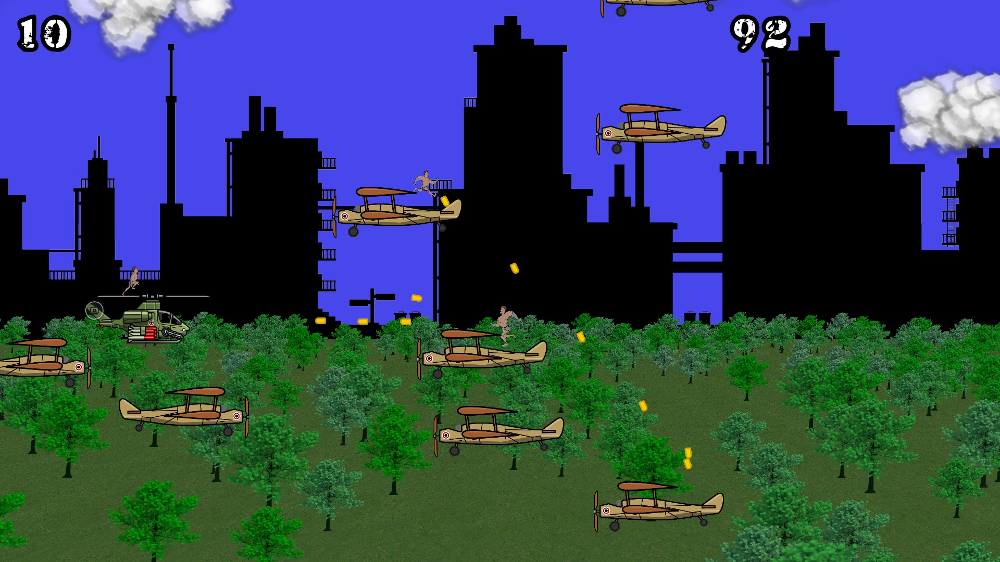
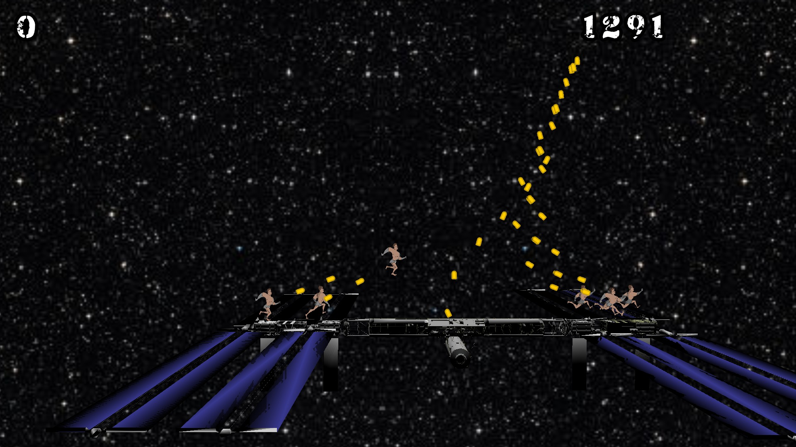

Action Nitro! an action platformer where you jump from plane to plane to reach the ISS and defeat the bad guys.

# Screenshot

# Compile and run - For those used to Nit

1. Compile the Nit tools from the root of this repository.
   Refer to the root README file for directions.

2. Install the packages requisited by _gamnit_.
   See the list in `../../lib/gamnit/README.md`.

3. Compile the game with a simple call to `make` from this folder.

4. Run with `bin/action_nitro`.

# Art

* Character art created by jeremygooch under CC-BY 3.0.
* City skyline created by Alucard under CC-BY 3.0.
* Helicopter art by SpriteAttack under CC-BY-SA 3.0.
* Planes, derived from the helicopter art created by Alexis Laferrière under CC-BY-SA 3.0.
* Parachute and powerups art created by Alexis Laferrière under CC0.
* Particles created by kenny.nl under CC0.
* Stars textures created by StumpyStrust under CC0.
* Splash background credit NASA.
* 3D model of ISS credit NASA Ames Research Center.
