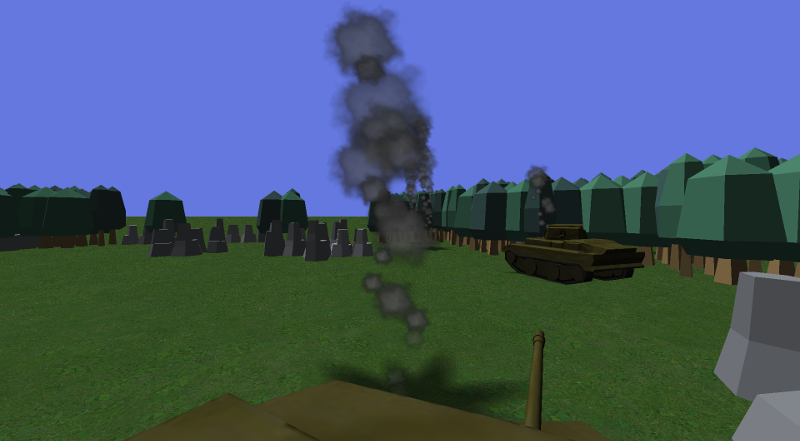

Tinks! a multiplayer crossplatform action game with destructible procedurally generated worlds

# Project description

Each player controls a tank, opens fire from the turret and navigates between the terrain features.
Explosions from turret fire and tank destruction have different forces and destroy the terrain.
Each tank needs 4 hits to be destroyed.
Destroyed tanks drop health powerups which can repair other tanks.

The game is optimized for the multiplayer mode but one can play alone to practice.
Upon launch, a client searches for server by broadcasting a UDP socket.
A server may respond with its TCP connection port.
If there is no answer, the client starts its own server which will accept other clients.

The game logic is mostly event based.
Only the events are passed to the clients at each frame, by serializing them to binary.
So both the clients and the server keep the game knowledge.

The world is different in each game, it is procedurally generated with an "unlimited" size.
Each world feature is discovered only as needed by either the server or the clients.
The server discovers the features affected by possible collisions and by explosions.
The clients discover the features visible on screen.
The clients and servers share the seed for the noise generator, so they discover the same features.
Only the destroyed features and new powerups are passed to the clients by the server as events.

# Modifications

This game was developed quickly while aiming to keep it simple.
It should be easy to add features as refinements on both the client and the server.

# Clients and server

Tinks! has a client and a dedicated server.
The whole project is modular, these software share mostly the same code.

* The 3D client at `bin/tinks3d` uses `gamnit` and OpenGL ES 2.0 for an immersive world.

  Despite the different graphics, both client are fully compatible for multiplayer.

  

* The dedicated server at `bin/server` acts as a headless server for clients on the same local network.

# Usage

Compile with: `make`

Launch with: `bin/tinks` or `bin/tinks3d`

Compile for Android with: `make bin/tinks.apk`

Launch a server with: `bin/server [server_port]`

Connect to a precise server with: `bin/tinks server_address [server_port]`

# Configuration on desktop for the 2D client

You can configure the client by modifying the file `./config.json` created when you first launch the game.
The fields `res_x` and `res_y` specify the resolution of the window.
The field `play_sounds` should be clear enough.

# Artwork

* Trees and rocks models created by Kenney.nl, shared under CC0
* Ground texture created by Duion, shared under CC0
* Health model created by Alexis Laferrière, shared under CC0
* Tank original model created by Sapen, shared under CC-BY-SA 3.0
	* Derivatives from this model were created by Alexis Laferrière, shared under CC-BY-SA 3.0
