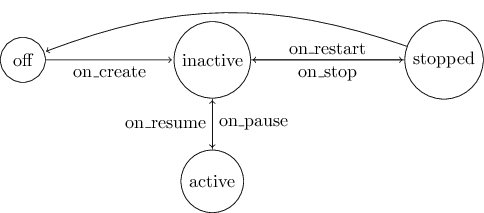

_app.nit_, a framework for portable applications

The framework provides services to manage common needs of modern mobile applications:

* Life-cycle
* User interface
* Persistence
* Async HTTP requests
* Package metadata
* Compilation and packaging

The features offered by _app.nit_ are common to all platforms, but
may not be available on all devices.

# Application Life-Cycle

The _app.nit_ application life-cycle is compatible with all target platforms.
It relies on the following sequence of events, represented here by their callback method name:

1. `on_create`: The application is being created.
   You should build the UI at this time and launch services.

2. `on_resume`: The app enters the active state, it is in the foreground and interactive.

3. `on_pause`: The app becomes inactive and it leaves the foreground.
   It may still be visible in the background.

4. `on_stop`: The app is completely hidden.
   It may then be destroyed (without warning) or go back to the active state with `on_restart`.

5. `on_restart`: The app goes back to the inactive state.
   You can revert what was done by `on_stop`.

Life-cycle events related to saving and restoring the application state are provided by two special callback methods:

* `on_save_state`: The app may be destroyed soon, save its state for a future `on_restore_state`.
  There is more on how it can be done in the `app::data_store` section.

* `on_restore_state`: The app is launching, restore its state from a previous `on_save_state`.

These events are synchronized to the native platforms applications
The `App` instance is the first to be notified of these events.
Other UI elements, from the `ui` submodule, are notified of the same events using a simple depth first visit.
So all UI elements can react separately to live-cycle events.

# User Interface

The `app::ui` module defines an abstract API to build a portable graphical application.
The API is composed of interactive `Control`s, visible `View`s and an active `Window`.

Here is a subset of the most useful controls and views:

* The classic pushable `Button` with text (usually rectangular).

* `TextInput` is a field for the user to enter text.

* `HorizontalLayout` and `VerticalLayout` organize other controls in order.

Each control is notified of input events by callbacks to `on_event`.
All controls have observers that are also notified of the events.
So there is two ways  to customize the behavior on a given event:

* Create a subclass of the wanted `Control`, let's say `Button`, and specialize `on_event`.

* Add an observer to a `Button` instance, and implement `on_event` in the observer.

## Usage Example

The example at `examples/ui_example.nit` shows off most features of `app::ui` in a minimal program.
You can also take a look at the calculator (`../../examples/calculator/src/calculator.nit`) which is a concrete usage example.

## Platform-specific UI

You can go beyond the portable UI API of _app.nit_ by using the natives services of a platform.

The suggested approach is to use platform specific modules to customize the application on a precise platform.
See the calculator example for an adaptation of the UI on Android,
the interesting module is in this repository at ../../examples/calculator/src/android_calculator.nit

# Persistent State with data\_store

_app.nit_ offers the submodule `app::data_store` to easily save the application state and user preferences.
The service is accessible by the method `App::data_store`. The `DataStore` itself defines 2 methods:

* `DataStore::[]=` saves and associates any serializable instances to a `String` key.
Pass `null` to clear the value associated to a key.

* `DataStore::[]` returns the object associated to a `String` key.
It returns `null` if nothing is associated to the key.

## Usage Example

~~~
import app::data_store

redef class App
	var user_name: String

	redef fun on_save_state
	do
		app.data_store["first run"] = false
		app.data_store["user name"] = user_name

		super # call `on_save_state` on all attached instances of `AppComponent`
	end

	redef fun on_restore_state
	do
		var first_run = app.data_store["first run"]
		if first_run != true then
			print "It's the first run of this application"
		end

		var user_name = app.data_store["user name"]
		if user_name isa String then
			self.user_name = user_name
		else self.user_name = "Undefined"

		super
	end
end
~~~

# Async HTTP request

The module `app::http_request` provides services to execute asynchronous HTTP request.
The class `AsyncHttpRequest` hides the complex parallel logic and
lets the user implement methods acting only on the UI thread.
See the documentation of `AsyncHttpRequest` for more information and
the full example at `examples/http_request_example.nit`.

# Metadata annotations

The _app.nit_ framework defines three annotations to customize the application package.

* `app_name` takes a single argument, the visible name of the application.
  This name is used for launchers and window title.
  By default, the name of the target module.

* `app_namespace` specifies the full namespace (or package name) of the application package.
  This value usually identify the application uniquely on application stores.
  It should not change once the application has benn published.
  By default, the namespace is `org.nitlanguage.{module_name}`.

* `app_version` specifies the version of the application package.
  This annotation expects at least one argument, usually we use three version numbers:
  the major, minor and revision.
  The special function `git_revision` will use the prefix of the hash of the latest git commit.
  By default, the version is 0.1.

* `app_files` tells the compiler where to find platform specific resource files associated to a module.
  By default, only the root of the project is searched for the folders `android` and `ios`.
  The `android` folder is used as base for the generated Android project,
  it can be used to specify the resource files, libs and even Java source files.
  The `ios` folder is searched for icons only.

  Each argument of `app_files` is a relative path to a folder containing extra `android` or `ios` folders.
  If there is no arguments, the parent folder of the annotated module is used.
  In case of name conflicts in the resource files, the files from the project root have the lowest priority,
  those associated to modules lower in the importation hierarchy have higher priority.

## Usage Example

~~~nitish
module my_module is
    app_name "My App"
    app_namespace "org.example.my_app"
    app_version(1, 0, git_revision)
end
~~~

# Compiling and Packaging an Application

The Nit compiler detects the target platform from the importations and generates the appropriate application format and package.

Applications using only the portable services of _app.nit_ require some special care at compilation.
Such an application, let's say `calculator.nit`, does not depend on a specific platform and use the portable UI.
The target platform must be specified to the compiler for it to produce the correct application package.
There is two main ways to achieve this goal:

* The mixin option (`-m module`) imports an additional module before compiling.
  It can be used to load platform specific implementations of the _app.nit_ portable UI.

  ~~~raw
  # GNU/Linux version, using GTK
  nitc calculator.nit -m linux

  # Android version
  nitc calculator.nit -m android

  # iOS version
  nitc calculator.nit -m ios
  ~~~

* A common alternative for larger projects is to use platform specific modules.
  Continuing with the calculator example, it is adapted for Android by the module `android_calculator.nit`.
  This module imports both `calculator` and `android`, it can then use Android specific code.

  ~~~nitish
  module android_calculator

  import calculator
  import android

  # ...
  ~~~
